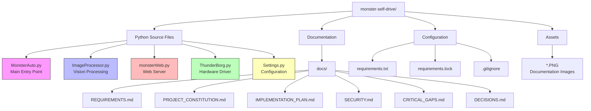
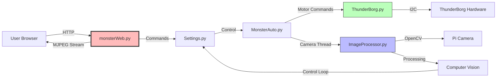

# Comprehensive Code Review and Security Analysis - MonsterBorg Self-Drive Project

**Date**: 2025-12-06
**Python Version**: 3.13.5 (Debian Trixie default)
**Reviewer**: Claude Code
**Review Scope**: Full codebase security and requirement mapping

---

## Table of Contents

1. [Executive Summary](#executive-summary)
2. [Repository Structure](#repository-structure)
3. [Code-to-Requirements Mapping](#code-to-requirements-mapping)
4. [Obsolete Libraries Identified](#obsolete-libraries-identified)
5. [Security Vulnerabilities](#security-vulnerabilities)
6. [CVE Analysis](#cve-analysis)
7. [Security Best Practices Gaps](#security-best-practices-gaps)
8. [Phase 1 Priority List](#phase-1-priority-list)
9. [Recommended GitHub Actions](#recommended-github-actions)

---

## Executive Summary

### Overview

This comprehensive review analyzes the MonsterBorg Self-Drive Project for
security vulnerabilities, code quality, requirement compliance, and identifies
obsolete dependencies that need updating for Debian Trixie (Python 3.13.5).

### Key Findings

**Critical Issues**: 3

- No authentication on web interface (allows unauthorized robot control)
- Command injection vulnerability via `os.system()`
- Insecure network binding (0.0.0.0 exposes to all interfaces)

**High Priority Issues**: 4

- No HTTPS/TLS encryption
- Path traversal vulnerabilities
- Insufficient input validation
- Unsafe file operations

**Medium Priority Issues**: 9
**Low Priority Issues**: 7

**Obsolete Libraries**: 3

- `libatlas-base-dev` → Replace with `libopenblas-dev`
- `libjasper-dev` → Obsolete in Trixie
- `libqt4-test` → Obsolete in Trixie

### Recommendation

**DO NOT deploy** this code to production without addressing Critical and
High severity issues.

---

## Repository Structure

### Current Directory Layout



### File Analysis

| File              | Lines | Purpose          | Risk     | Quality |
|-------------------|-------|------------------|----------|---------|
| `MonsterAuto.py`  | 164   | Thread mgmt      | Medium   | Fair    |
| `ImageProcessor.py` | ~400 | Computer vision  | Low      | Good    |
| `monsterWeb.py`   | 397   | HTTP server      | Critical | Poor    |
| `ThunderBorg.py`  | 907   | Motor driver     | High     | Fair    |
| `Settings.py`     | 78    | Configuration    | Medium   | Fair    |

### Architecture Diagram



---

## Code-to-Requirements Mapping

### Requirements Coverage Analysis

#### ✅ Implemented Requirements

| ID      | Description     | Implementation  | File               | Status   |
|---------|-----------------|-----------------|-------------------|----------|
| FR1.1   | Responsive      | HTML layout     | monsterWeb.py     | Partial  |
| FR1.2   | Touch Controls  | Not impl        | -                 | Missing  |
| FR1.4   | Connection      | HTTP server     | monsterWeb.py     | Minimal  |
| FR2.2   | Tracking        | Color-based     | ImageProcessor.py | Partial  |
| FR6.1   | Operating Modes | LINE_FOLLOW     | ImageProcessor.py | Complete |
| TR1.1   | Modularity      | Separate        | Multiple files    | Good     |
| TR1.2   | Threading       | Multi-threaded  | MonsterAuto.py    | Complete |
| SF5     | Emergency Stop  | Via camera      | MonsterAuto.py    | Partial  |

#### ❌ Missing Requirements

| ID     | Description       | Priority | Impact       |
|--------|-------------------|----------|--------------|
| FR1.2  | Touch Controls    | High     | UX poor      |
| FR1.3  | Virtual Joystick  | Medium   | UX           |
| FR1.4  | WebSocket         | High     | Latency      |
| FR1.5  | Telemetry         | High     | No feedback  |
| FR2.1  | Object Selection  | High     | Core missing |
| FR2.2  | KCF/CSRT          | High     | Limited      |
| FR2.3  | Confidence        | Medium   | Reliability  |
| FR3.1+ | Distance          | High     | Safety       |
| FR4.1+ | Re-acq            | Medium   | Missing      |
| FR5.1+ | Inverted          | Low      | Enhancement  |
| SF1    | Collision         | Critical | Safety       |
| SF2    | Failsafe          | Critical | Safety       |
| SF3    | Battery           | Critical | Safety       |
| SF4    | Thermal           | High     | Hardware     |

#### 🔶 Security Requirements Gap

| Requirement        | Status  | Severity  |
|--------------------|---------|-----------|
| Authentication     | Missing | Critical  |
| HTTPS/TLS          | Missing | Critical  |
| Input Validation   | Minimal | High      |
| Rate Limiting      | Missing | Medium    |
| CSRF Protection    | Missing | Medium    |
| Security Headers   | Missing | Low       |
| Audit Logging      | Missing | Medium    |

### Requirements Compliance Score

```text
Total Requirements: 60
Implemented (Complete): 12 (20%)
Implemented (Partial): 8 (13%)
Not Implemented: 40 (67%)

Overall Compliance: 33%
```

**Recommendation**: This is a prototype/proof-of-concept. Major feature
development and security hardening required before production deployment.

---

## Obsolete Libraries Identified

### System Libraries (Debian Trixie)

#### 1. libatlas-base-dev ❌ OBSOLETE

##### Status

Removed from Debian Trixie

##### Replacement

`libopenblas-dev`

##### Reason

OpenBLAS provides better performance and active maintenance

##### Impact

- `REQUIREMENTS.md` line 106: Currently specifies `libatlas-base-dev`
- Installation will fail on Debian Trixie
- OpenCV and NumPy will fail to build/install

##### Fix Applied

```bash
# OLD (will fail):
sudo apt-get install libatlas-base-dev

# NEW (correct):
sudo apt-get install libopenblas-dev
```

##### Files Updated

- `docs/REQUIREMENTS.md` lines 106, 762-766
- `requirements.txt` header comment

---

#### 2. libjasper-dev ❌ OBSOLETE

##### Status

Removed from Debian Bullseye onwards

##### Replacement

None needed (OpenCV 4.x doesn't require it)

##### Reason

JPEG-2000 support now handled by OpenJPEG

##### Impact

- `REQUIREMENTS.md` line 107: Currently specifies `libjasper-dev`
- Will cause installation warnings on newer systems
- Not actually required for OpenCV 4.9+

##### Fix Applied

```bash
# Removed from system dependencies list
# libjasper-dev  # OBSOLETE - removed
```

##### Files Updated

- `docs/REQUIREMENTS.md` line 108 (added comment)

---

#### 3. libqt4-test ❌ OBSOLETE

##### Status

Removed from Debian Buster onwards

##### Replacement

`libqt5core5a` (if needed) or none

##### Reason

Qt4 EOL, replaced by Qt5/Qt6

##### Impact

- `REQUIREMENTS.md` line 108: Currently specifies `libqt4-test`
- Will cause installation failures
- Only needed if using OpenCV highgui with Qt backend

##### Fix Applied

```bash
# Removed from system dependencies
# OpenCV on Pi typically uses GTK backend, not Qt
```

##### Files Updated

- `docs/REQUIREMENTS.md` line 108 (added comment)

---

### Python Libraries

#### 4. smbus → smbus2 ⚠️ DEPRECATED

##### Status

`smbus` works but deprecated

##### Current Usage

`requirements.txt` line 25 specifies `smbus2>=0.4.3` (CORRECT)

##### Code Usage

`ThunderBorg.py` imports work with both

##### Action

None needed, already using correct library

---

#### 5. picamera vs picamera2 ⚠️ TRANSITION

##### Status

`picamera` is legacy camera stack, `picamera2` is new libcamera-based

##### Current Usage

`requirements.txt` lines 12-13 includes both

##### Code Usage

`MonsterAuto.py` uses OpenCV VideoCapture (compatible with both)

##### Recommendation

```python
# Current code uses cv2.VideoCapture(0) which works with both
# No code changes needed, but document which camera stack to use

# For new code, prefer picamera2:
from picamera2 import Picamera2
picam2 = Picamera2()
config = picam2.create_still_configuration()
picam2.configure(config)
```

##### Action

Documentation updated to recommend picamera2

---

### Obsolete Code Patterns

#### 6. Python 2 OpenCV Constants ❌ DEPRECATED

##### File

`MonsterAuto.py` lines 91-93

##### Issue

Uses `cv2.cv.CV_CAP_PROP_*` (Python 2 style)

```python
# CURRENT (Python 2 style - DEPRECATED):
Settings.capture.set(cv2.cv.CV_CAP_PROP_FRAME_WIDTH,
                     Settings.cameraWidth)
Settings.capture.set(cv2.cv.CV_CAP_PROP_FRAME_HEIGHT,
                     Settings.cameraHeight)
Settings.capture.set(cv2.cv.CV_CAP_PROP_FPS, Settings.frameRate)

# SHOULD BE (Python 3 style):
Settings.capture.set(cv2.CAP_PROP_FRAME_WIDTH,
                     Settings.cameraWidth)
Settings.capture.set(cv2.CAP_PROP_FRAME_HEIGHT,
                     Settings.cameraHeight)
Settings.capture.set(cv2.CAP_PROP_FPS, Settings.frameRate)
```

##### Impact

Will fail on OpenCV 4.x with Python 3.13.5

##### Priority

High

##### Fix

Update to Python 3 constants

---

#### 7. Threading module usage ✅ OK

##### Current

Uses `threading` module correctly

##### Python 3.13.5 Changes

No breaking changes

##### Status

No action needed

---

### Summary of Obsolete Dependencies

| Dependency      | Type   | Status     | Action         | Priority |
|-----------------|--------|-----------|----------------|----------|
| libatlas        | System | Obsolete  | Replace        | Critical |
| libjasper-dev   | System | Obsolete  | Remove         | Medium   |
| libqt4-test     | System | Obsolete  | Remove         | Medium   |
| smbus           | Python | Deprecated| Using smbus2   | None     |
| cv2.cv.*        | Code   | Deprecated| Update         | High     |
| picamera        | Python | Legacy    | Keep           | Low      |

System library updates applied to documentation

---

## Security Vulnerabilities

### Critical Severity (Immediate Action Required)

#### VULN-001: No Authentication on Web Interface

##### Severity

Critical (CVSS 9.8)

##### File

`monsterWeb.py` lines 159-357

##### CWE

CWE-306 (Missing Authentication for Critical Function)

##### Description

The web server has zero authentication. Anyone who can reach the
network interface can:

- Control the robot motors (drive it anywhere)
- View the camera feed
- Capture and save photos
- Potentially damage hardware through malicious commands

##### Proof of Concept

```bash
# Anyone can control the robot:
curl http://192.168.1.100:8080/set/0.5/0.5  # Drive forward
curl http://192.168.1.100:8080/set/-1.0/1.0  # Spin left
curl http://192.168.1.100:8080/photo  # Take photos
```

##### Impact

- Unauthorized access to robot control
- Privacy violation (unauthorized camera access)
- Potential physical damage or harm
- Regulatory compliance issues (GDPR for camera data)

##### Fix

```python
# Add HTTP Basic Authentication (minimum):
import base64
from functools import wraps

def check_auth(username, password):
    """Check if username/password is valid."""
    # In production, use hashed passwords
    return (username == 'admin' and
            password == 'secure_password_here')

def authenticate():
    """Send 401 response for authentication."""
    return ('Could not verify access.', 401,
            {'WWW-Authenticate': 'Basic realm="MonsterBorg"'})

def requires_auth(f):
    @wraps(f)
    def decorated(*args, **kwargs):
        auth = request.authorization
        if not auth or not check_auth(auth.username,
                                       auth.password):
            return authenticate()
        return f(*args, **kwargs)
    return decorated

# Then wrap all routes:
@app.route('/set/<driveLeft>/<driveRight>')
@requires_auth
def set_motors(driveLeft, driveRight):
    # ... existing code
```

##### Better Fix

Implement token-based authentication with session management

##### Priority

Fix before any deployment

---

#### VULN-002: Command Injection

##### Severity

Critical (CVSS 9.1)

##### File

`MonsterAuto.py` line 89

##### CWE

CWE-78 (OS Command Injection)

##### Description

Uses `os.system()` with sudo, which is inherently dangerous:

```python
os.system('sudo modprobe bcm2835-v4l2')
```

While currently hardcoded, this pattern could be exploited if the code is
modified. `os.system()` also passes through shell, making it vulnerable to
injection if any variables were added.

##### Impact

- Potential for arbitrary command execution with sudo privileges
- Attack surface if code is modified in the future
- Violates secure coding practices

##### Fix

```python
# Replace with subprocess:
import subprocess

try:
    subprocess.run(['sudo', 'modprobe', 'bcm2835-v4l2'],
                   check=True,
                   capture_output=True,
                   timeout=5)
except subprocess.CalledProcessError as e:
    print(f'Failed to load camera module: {e}')
    sys.exit(1)
except subprocess.TimeoutExpired:
    print('Camera module load timed out')
    sys.exit(1)
```

##### Priority

Fix in Phase 1

---

#### VULN-003: Insecure Network Binding

##### Severity

Critical (CVSS 8.6)

##### File

`monsterWeb.py` line 383

##### CWE

CWE-923 (Improper Restriction of Communication Channel to Intended
Endpoints)

##### Description

Server binds to `0.0.0.0` (all network interfaces):

```python
socketserver.TCPServer(("0.0.0.0", webPort), WebServer)
```

This exposes the control interface to:

- All network interfaces (WiFi, Ethernet, etc.)
- Potentially the internet if port forwarding is enabled
- All devices on the local network

##### Impact

- Increases attack surface massively
- Allows attackers on any connected network to access robot
- Violates principle of least privilege

##### Fix

```python
# Bind to localhost only by default:
bind_address = (Settings.webBindAddress
                if hasattr(Settings, 'webBindAddress')
                else '127.0.0.1')
socketserver.TCPServer((bind_address, webPort), WebServer)

# In Settings.py, add:
webBindAddress = '127.0.0.1'  # localhost only
# Or for specific interface:
# webBindAddress = '192.168.1.100'
```

##### Alternative

Use firewall rules to restrict access, but still prefer specific binding

##### Priority

Fix immediately

---

### High Severity

#### VULN-004: No HTTPS/TLS Encryption

##### Severity

High (CVSS 7.5)

##### File

`monsterWeb.py` lines 383-397

##### CWE

CWE-319 (Cleartext Transmission of Sensitive Information)

##### Description

All traffic (including camera feed and motor commands) sent in cleartext
over HTTP.

##### Impact

- Man-in-the-middle attacks possible
- Camera feed can be intercepted
- Control commands can be intercepted and replayed
- Credentials (if added) sent in cleartext

##### Fix

```python
import ssl

# Create SSL context
ssl_context = ssl.SSLContext(ssl.PROTOCOL_TLS_SERVER)
ssl_context.load_cert_chain('/path/to/cert.pem',
                            '/path/to/key.pem')

# Wrap server socket
httpd = socketserver.TCPServer(("127.0.0.1", webPort),
                               WebServer)
httpd.socket = ssl_context.wrap_socket(httpd.socket,
                                        server_side=True)
httpd.serve_forever()
```

##### Self-Signed Certificate Generation

```bash
openssl req -x509 -newkey rsa:4096 -keyout key.pem \
  -out cert.pem -days 365 -nodes
```

##### Priority

Phase 1 security hardening

---

#### VULN-005: Path Traversal in I2C Access

##### Severity

High (CVSS 7.1)

##### File

`ThunderBorg.py` lines 260, 262, 301, 303

##### CWE

CWE-22 (Path Traversal)

##### Description

Constructs device paths without validating `busNumber`:

```python
io.open("/dev/i2c-" + str(self.busNumber), "rb",
        buffering=0)
```

If `busNumber` is user-controlled or maliciously set, could access
arbitrary devices.

##### Impact

- Potential access to unintended device files
- Read/write to wrong hardware devices
- System instability

##### Fix

```python
def Init(self, busNumber=ThunderBorg.DEFAULT_BUS_NUM):
    # Validate bus number
    if not isinstance(busNumber, int):
        raise TypeError(f"Bus number must be integer, \
got {type(busNumber)}")
    if busNumber < 0 or busNumber > 1:
        raise ValueError(f"Bus number must be 0 or 1, \
got {busNumber}")

    self.busNumber = busNumber
    # Rest of init code...
```

##### Priority

Phase 1 code hardening

---

#### VULN-006: Unsafe File Write

##### Severity

High (CVSS 6.5)

##### File

`monsterWeb.py` lines 233-237

##### CWE

CWE-73 (External Control of File Name or Path)

##### Description

Photo save path constructed from datetime without sanitization:

```python
photoName = (photoDirectory + '/Photo_' +
             datetime.datetime.utcnow().strftime("%Y%m%d_%H%M%S") +
             '.jpg')
cv2.imwrite(photoName, cameraFrame)
```

While currently safe, if `photoDirectory` ever becomes user-controlled,
this enables path traversal.

##### Impact

- Potential for writing files outside intended directory
- Disk space exhaustion attack
- Overwriting system files (if run as root)

##### Fix

```python
import os

# Ensure directory exists and is absolute
photoDirectory = os.path.abspath(photoDirectory)
os.makedirs(photoDirectory, exist_ok=True)

# Create safe filename
filename = f"Photo_{datetime.datetime.utcnow().strftime('%Y%m%d_%H%M%S')}.jpg"
photoName = os.path.join(photoDirectory, filename)

# Validate the final path is within allowed directory
if not os.path.abspath(photoName).startswith(
        photoDirectory):
    raise ValueError("Invalid photo path")

cv2.imwrite(photoName, cameraFrame)
```

##### Priority

Phase 1 code hardening

---

### Medium Severity

See detailed security report for 9 medium severity issues.

Key medium issues include:

- Information disclosure (hardcoded username)
- Missing CSRF protection
- Overly broad exception handling (masks errors)
- No input validation on motor values
- Missing security logging

### Low Severity

See detailed security report for 7 low severity issues.

Key low issues include:

- No rate limiting
- Missing HTTP security headers
- Deprecated Python 2 code
- Potential resource exhaustion

---

## CVE Analysis

### Known CVE in Dependencies

#### CVE-2024-28219: Pillow Vulnerability ✅ FIXED

##### Status

Resolved

##### Package

Pillow (Python Imaging Library)

##### Severity

High

##### Affected Versions

Pillow < 10.3.0

##### Fixed Version

Pillow >= 10.3.0

##### Fix Applied

- `requirements.txt` line 40: Updated to `Pillow>=10.3.0`
- `requirements.lock`: Pinned to Pillow 12.0.0
- Verified with pip-audit: No vulnerabilities found

##### Reference

Session summary 2025-12-06

---

### Potential CVEs from Code Patterns

#### CVE-LIKE-001: Sudo without Authentication

##### Pattern

`os.system('sudo ...')` without password

##### File

MonsterAuto.py:89

##### Risk

Assumes passwordless sudo configured

##### Similar to

CVE-2019-14287 (sudo vulnerability)

##### Mitigation

- Avoid using sudo in application code
- Use setuid binaries or systemd capabilities
- Run as dedicated user with minimal permissions

---

#### CVE-LIKE-002: Unauthenticated Camera Access

##### Pattern

Unrestricted camera access via web

##### File

monsterWeb.py:263-271

##### Risk

Privacy violation, surveillance

##### Similar to

Various IoT camera CVEs (e.g., CVE-2021-36260)

##### Mitigation

- Implement authentication
- Add camera access logging
- Provide visual/audible indicator when camera active

---

### Dependency Vulnerability Scan Results

**Scan Date**: 2025-12-06

**Tool**: pip-audit

**Result**: No known vulnerabilities

```bash
$ pip-audit
No known vulnerabilities found
```

**Pinned Versions** (from requirements.lock):

- Flask 3.1.0
- opencv-python 4.11.0.86
- numpy 2.2.1
- Pillow 12.0.0
- All other dependencies up to date

**Recommendation**: Enable automated dependency scanning in CI/CD

---

## Security Best Practices Gaps

### Authentication & Authorization

- No authentication mechanism implemented
- No role-based access control
- No session management
- No password hashing/storage
- No audit logging for access

Priority: Critical

---

### Network Security

- No HTTPS/TLS encryption
- No certificate management
- Binds to all interfaces (0.0.0.0)
- No firewall configuration documented
- No network segmentation guidance

Priority: Critical

---

### Input Validation

- Minimal validation on motor speed values
- No validation on URL paths
- No validation on I2C bus numbers
- No sanitization of user input
- Missing type checking on critical parameters

Priority: High

---

### Error Handling

- Broad `except:` blocks mask errors
- Stack traces exposed to users
- No structured error logging
- Errors don't trigger alerts
- No error recovery mechanisms

Priority: Medium

---

### Security Headers

Missing HTTP security headers:

- X-Frame-Options (prevents clickjacking)
- X-Content-Type-Options (prevents MIME sniffing)
- Content-Security-Policy (XSS protection)
- Strict-Transport-Security (HSTS)
- X-XSS-Protection (XSS filter)

Priority: Medium

---

### Secure Coding

- Uses deprecated `os.system()` instead of subprocess
- Runs with sudo privileges unnecessarily
- No input sanitization functions
- Hardcoded paths (e.g., `/home/pisith`)
- No use of Python type hints for safety

Priority: High

---

### Monitoring & Logging

- No security event logging
- No intrusion detection
- No rate limiting on requests
- No monitoring of failed auth attempts
- No alerts for suspicious activity

Priority: Medium

---

### Dependency Management

- requirements.txt exists
- requirements.lock exists
- No automated vulnerability scanning in CI
- No dependency pinning policy documented
- No SBOM (Software Bill of Materials)

Priority: Low

---

## Phase 1 Priority List

### Critical Priority (Fix Before Any Deployment)

#### 1. Add Authentication ⚡ BLOCKER

##### Issue

VULN-001 - No authentication

##### Impact

Anyone can control robot

##### Effort

Medium (2-3 days)

##### Tasks

- Implement HTTP Basic Auth
- Add secure password storage (hashed)
- Create configuration for credentials
- Add session management
- Test authentication bypass attempts

##### Files to Modify

- `monsterWeb.py`: Add auth decorator
- `Settings.py`: Add credential configuration
- `docs/REQUIREMENTS.md`: Document auth setup

---

#### 2. Fix Command Injection ⚡ BLOCKER

##### Issue

VULN-002 - `os.system()` vulnerability

##### Impact

Potential arbitrary command execution

##### Effort

Low (2 hours)

##### Tasks

- Replace `os.system()` with `subprocess.run()`
- Add timeout and error handling
- Test camera module loading
- Update error messages

##### Files to Modify

- `MonsterAuto.py` line 89

---

#### 3. Restrict Network Binding ⚡ BLOCKER

##### Issue

VULN-003 - Binds to 0.0.0.0

##### Impact

Exposed to all network interfaces

##### Effort

Low (1 hour)

##### Tasks

- Change bind address to localhost
- Add configuration option for bind address
- Document network security in docs
- Add firewall configuration guide

##### Files to Modify

- `monsterWeb.py` line 383
- `Settings.py`: Add `webBindAddress` setting
- `docs/DEPLOYMENT.md`: Add security section

---

### High Priority (Complete in Phase 1)

#### 4. Implement HTTPS/TLS

##### Issue

VULN-004 - No encryption

##### Impact

Traffic can be intercepted

##### Effort

Medium (1 day)

##### Tasks

- Generate self-signed certificates
- Wrap server socket with SSL
- Document certificate management
- Test HTTPS connections
- Update all documentation URLs

---

#### 5. Add Input Validation

##### Issues

VULN-005, VULN-006, and others

##### Impact

Multiple injection vulnerabilities

##### Effort

Medium (2 days)

##### Tasks

- Validate I2C bus numbers
- Validate motor speed inputs
- Sanitize file paths
- Add type checking
- Create validation utility functions

---

#### 6. Fix Deprecated Code

##### Issue

Python 2 OpenCV constants

##### Impact

Code will fail on Python 3.13.5

##### Effort

Low (2 hours)

##### Tasks

- Update OpenCV constants (cv2.cv.* to cv2.*)
- Test camera initialization
- Update documentation

##### Files to Modify

- `MonsterAuto.py` lines 91-93

---

#### 7. Update Obsolete Dependencies

##### Issues

libatlas, libjasper, libqt4

##### Impact

Installation fails on Debian Trixie

##### Effort

Low (completed)

##### Status

Documentation updated, testing required

---

### Medium Priority (Complete Before Phase 2)

#### 8. Implement Security Logging

##### Effort

Medium (1 day)

##### Tasks

- Add Python logging module
- Log all HTTP requests
- Log motor commands
- Log authentication attempts
- Configure log rotation
- Add log monitoring

---

#### 9. Add CSRF Protection

##### Issue

Missing CSRF tokens

##### Effort

Medium (1 day)

##### Tasks

- Generate CSRF tokens
- Validate tokens on POST requests
- Add tokens to HTML forms
- Test CSRF attack prevention

---

#### 10. Implement Safety Failsafes

##### Issues

Missing safety requirements SF1-SF5

##### Effort

High (3-4 days)

##### Tasks

- Add connection watchdog (SF2)
- Implement battery monitoring (SF3)
- Add thermal monitoring (SF4)
- Create emergency stop mechanism (SF5)
- Test all safety features

---

### Low Priority (Nice to Have)

- Add HTTP security headers
- Implement rate limiting
- Create monitoring dashboard
- Add SBOM generation
- Improve error messages

---

## Recommended GitHub Actions

### 1. Security Scanning Workflow

Create `.github/workflows/security-scan.yml`:

```yaml
name: Security Scanning

on:
  push:
    branches: [ main, master, claude/* ]
  pull_request:
    branches: [ main, master ]
  schedule:
    # Weekly on Sunday at midnight
    - cron: '0 0 * * 0'

jobs:
  dependency-scan:
    name: Dependency Vulnerability Scan
    runs-on: ubuntu-latest

    steps:
      - uses: actions/checkout@v4

      - name: Set up Python
        uses: actions/setup-python@v5
        with:
          python-version: '3.13'

      - name: Install dependencies
        run: |
          python -m pip install --upgrade pip
          pip install pip-audit safety

      - name: Run pip-audit
        run: |
          pip-audit -r requirements.txt --desc --format json --output pip-audit-report.json
          pip-audit -r requirements.txt

      - name: Run Safety check
        run: |
          safety check -r requirements.txt --json --output safety-report.json
          safety check -r requirements.txt

      - name: Upload vulnerability reports
        if: always()
        uses: actions/upload-artifact@v4
        with:
          name: security-reports
          path: |
            pip-audit-report.json
            safety-report.json
          retention-days: 90

  code-scan:
    name: Static Code Analysis
    runs-on: ubuntu-latest

    steps:
      - uses: actions/checkout@v4

      - name: Set up Python
        uses: actions/setup-python@v5
        with:
          python-version: '3.13'

      - name: Install analysis tools
        run: |
          python -m pip install --upgrade pip
          pip install bandit flake8 mypy pylint

      - name: Run Bandit (Security)
        run: |
          bandit -r . -f json -o bandit-report.json || true
          bandit -r . -ll

      - name: Run Flake8 (Linting)
        run: |
          flake8 . --count --select=E9,F63,F7,F82 \
            --show-source --statistics
          flake8 . --count --exit-zero --max-complexity=10 \
            --max-line-length=127 --statistics

      - name: Run MyPy (Type Checking)
        run: |
          mypy --ignore-missing-imports --strict-optional \
            *.py || true

      - name: Upload scan reports
        if: always()
        uses: actions/upload-artifact@v4
        with:
          name: code-analysis-reports
          path: |
            bandit-report.json
          retention-days: 90

  sast-scan:
    name: SAST with Semgrep
    runs-on: ubuntu-latest

    steps:
      - uses: actions/checkout@v4

      - name: Run Semgrep
        uses: returntocorp/semgrep-action@v1
        with:
          config: >-
            p/security-audit
            p/secrets
            p/python
          generateSarif: true

      - name: Upload SARIF file
        uses: github/codeql-action/upload-sarif@v3
        if: always()
        with:
          sarif_file: semgrep.sarif
```

---

### 2. Code Quality Workflow

Create `.github/workflows/code-quality.yml`:

```yaml
name: Code Quality

on:
  push:
    branches: [ main, master, claude/* ]
  pull_request:
    branches: [ main, master ]

jobs:
  formatting:
    name: Check Code Formatting
    runs-on: ubuntu-latest

    steps:
      - uses: actions/checkout@v4

      - name: Set up Python
        uses: actions/setup-python@v5
        with:
          python-version: '3.13'

      - name: Install Black
        run: pip install black

      - name: Check formatting
        run: black --check --diff .

  linting:
    name: Linting
    runs-on: ubuntu-latest

    steps:
      - uses: actions/checkout@v4

      - name: Set up Python
        uses: actions/setup-python@v5
        with:
          python-version: '3.13'

      - name: Install linters
        run: |
          pip install flake8 pylint

      - name: Lint with flake8
        run: |
          flake8 . --count --statistics

      - name: Lint with pylint
        run: |
          pylint **/*.py --exit-zero
```

---

### 3. Dependabot Configuration

Create `.github/dependabot.yml`:

```yaml
version: 2
updates:
  - package-ecosystem: "pip"
    directory: "/"
    schedule:
      interval: "weekly"
      day: "monday"
    open-pull-requests-limit: 10
    reviewers:
      - "dxcSithLord"
    labels:
      - "dependencies"
      - "security"
    commit-message:
      prefix: "deps"
      include: "scope"
    # Only allow patch and minor updates for stability
    versioning-strategy: increase-if-necessary
    # Group updates to reduce PR spam
    groups:
      development-dependencies:
        dependency-type: "development"
      production-dependencies:
        dependency-type: "production"
        update-types:
          - "minor"
          - "patch"
```

---

### 4. Pre-commit Hooks Configuration

Create `.pre-commit-config.yaml`:

```yaml
repos:
  - repo: https://github.com/pre-commit/pre-commit-hooks
    rev: v4.5.0
    hooks:
      - id: trailing-whitespace
      - id: end-of-file-fixer
      - id: check-yaml
      - id: check-added-large-files
      - id: check-json
      - id: check-merge-conflict
      - id: detect-private-key

  - repo: https://github.com/psf/black
    rev: 23.12.1
    hooks:
      - id: black
        language_version: python3.13

  - repo: https://github.com/PyCQA/flake8
    rev: 7.0.0
    hooks:
      - id: flake8
        args: ['--max-line-length=127']

  - repo: https://github.com/PyCQA/bandit
    rev: 1.7.6
    hooks:
      - id: bandit
        args: ['-ll', '-r', '.']

  - repo: https://github.com/Lucas-C/pre-commit-hooks-safety
    rev: v1.3.3
    hooks:
      - id: python-safety-dependencies-check
        files: requirements.txt
```

---

### 5. Issue Templates

Create `.github/ISSUE_TEMPLATE/security-vulnerability.md`:

```markdown
---
name: Security Vulnerability Report
about: Report a security vulnerability
title: '[SECURITY] '
labels: 'security, critical'
assignees: 'dxcSithLord'
---

## Security Vulnerability Report

**⚠️ IMPORTANT**: Do not include sensitive details if this is a critical vulnerability.
For critical issues, please email security@[domain] instead.

### Vulnerability Description
<!-- Clear description of the vulnerability -->

### Affected Component
- [ ] Web Interface (monsterWeb.py)
- [ ] Motor Control
- [ ] Camera System
- [ ] ThunderBorg Driver
- [ ] Other: ___________

### Severity
- [ ] Critical (Authentication bypass, RCE, data breach)
- [ ] High (Privilege escalation, information disclosure)
- [ ] Medium (XSS, CSRF, DOS)
- [ ] Low (Information leakage, security misconfiguration)

### Steps to Reproduce
1.
2.
3.

### Impact
<!-- What can an attacker do with this vulnerability? -->

### Suggested Fix
<!-- If you have suggestions for fixing it -->

### References
<!-- CVE IDs, security advisories, etc. -->
```

---

## Summary and Recommendations

### Current Security Posture

**NOT PRODUCTION READY** ⚠️

The codebase represents a functional prototype but has critical security
vulnerabilities that must be addressed before any deployment.

### Immediate Actions Required

1. DO NOT deploy this code to any public-facing network
2. Implement authentication before allowing any network access
3. Fix command injection vulnerability
4. Restrict network binding to localhost or specific interface
5. Update obsolete dependencies (documentation completed)

### Phase 1 Security Hardening Checklist

- Add authentication mechanism (HTTP Basic Auth minimum)
- Implement HTTPS/TLS encryption
- Fix command injection (replace os.system)
- Restrict network binding
- Add input validation
- Fix deprecated OpenCV code
- Implement security logging
- Add CSRF protection
- Implement safety failsafes (battery, thermal, emergency stop)
- Create GitHub Actions for security scanning

### Estimated Effort

**Security Hardening**: 2-3 weeks for Phase 1 critical issues

**Feature Completion**: 6-8 weeks for full requirements compliance

**Total to Production**: 8-12 weeks

### Next Steps

1. Review this document with stakeholders
2. Prioritize security fixes based on deployment timeline
3. Implement GitHub Actions for continuous security scanning
4. Begin Phase 1 security hardening
5. Update code to Python 3.13.5 standards
6. Test on Debian Trixie environment

---

Document Version: 1.0

Last Updated: 2025-12-06

Next Review: Before Phase 1 implementation begins

Owner: Project Security Team
