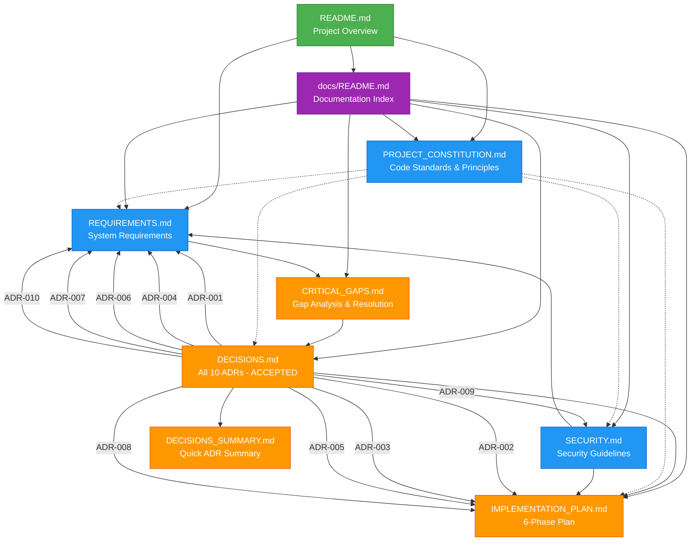

# Documentation Map

**Last Updated:** 2025-12-07
**Purpose:** Visual guide to documentation structure and relationships

---

## Document Relationship Diagram

---

## Document Categories

### 📘 Core Documentation (Current State)

**PROJECT_CONSTITUTION.md**
- Purpose: Code standards, architectural principles, development guidelines
- Audience: All developers
- Status: Active reference
- References: All other documents follow this

**REQUIREMENTS.md**
- Purpose: System requirements, hardware specs, performance targets
- Audience: Developers, testers
- Status: Active specification
- Links to: DECISIONS.md (ADR-001, 004, 006, 007, 010)

**SECURITY.md**
- Purpose: Security guidelines, threat model, best practices
- Audience: Developers, security reviewers
- Status: Active reference
- Links to: DECISIONS.md (ADR-009), IMPLEMENTATION_PLAN.md

### 🎯 Planning & Decisions (Current State)

**DECISIONS.md**
- Purpose: All 10 Architectural Decision Records (ADRs)
- Status: All ADRs ACCEPTED ✅
- ADRs: 001-006 (2025-12-06), 007-010 (2025-12-07)
- Links to: All core documents

**DECISIONS_SUMMARY.md**
- Purpose: Quick summary of all ADRs and progress
- Status: Updated 2025-12-07 (100% complete)
- Links to: DECISIONS.md, CRITICAL_GAPS.md

**CRITICAL_GAPS.md**
- Purpose: Gap analysis and resolution tracking
- Status: All P0 and P1 gaps resolved
- Links to: DECISIONS.md (ADR references)

**IMPLEMENTATION_PLAN.md**
- Purpose: 6-phase implementation roadmap
- Status: Ready for Phase 1 implementation
- Links to: DECISIONS.md, REQUIREMENTS.md

### 🗺️ Navigation

**docs/README.md**
- Purpose: Documentation index and reading guide
- Audience: All users
- Links to: All documentation files

**README.md** (root)
- Purpose: Project overview and quick start
- Audience: New users, contributors
- Links to: docs/README.md, core documentation

---

## Cross-Reference Index

### ADR References

| ADR | Primary Document | Related Documents |
|-----|------------------|-------------------|
| ADR-001: WebSocket Library | DECISIONS.md | IMPLEMENTATION_PLAN.md, REQUIREMENTS.md |
| ADR-002: Configuration Format | DECISIONS.md | IMPLEMENTATION_PLAN.md |
| ADR-003: Directory Structure | DECISIONS.md | IMPLEMENTATION_PLAN.md |
| ADR-004: Multi-User Control | DECISIONS.md | REQUIREMENTS.md, SECURITY.md |
| ADR-005: Tracking Algorithm | DECISIONS.md | IMPLEMENTATION_PLAN.md, REQUIREMENTS.md |
| ADR-006: IMU Hardware Status | DECISIONS.md | REQUIREMENTS.md |
| ADR-007: Frame Rate Requirements | DECISIONS.md | REQUIREMENTS.md |
| ADR-008: Threading Model | DECISIONS.md | IMPLEMENTATION_PLAN.md |
| ADR-009: Safety System | DECISIONS.md | SECURITY.md, REQUIREMENTS.md |
| ADR-010: GPIO Pin Assignments | DECISIONS.md | REQUIREMENTS.md |

### Key Concepts

| Concept | Primary Source | Also See |
|---------|---------------|----------|
| Safety Architecture | DECISIONS.md (ADR-009) | SECURITY.md, REQUIREMENTS.md |
| Threading Model | DECISIONS.md (ADR-008) | IMPLEMENTATION_PLAN.md |
| Multi-User Control | DECISIONS.md (ADR-004) | REQUIREMENTS.md |
| Frame Rate & Speed Limiting | DECISIONS.md (ADR-007) | REQUIREMENTS.md |
| GPIO & Hardware | DECISIONS.md (ADR-010) | REQUIREMENTS.md |
| Configuration System | DECISIONS.md (ADR-002) | IMPLEMENTATION_PLAN.md |
| Directory Structure | DECISIONS.md (ADR-003) | IMPLEMENTATION_PLAN.md |
| WebSocket Implementation | DECISIONS.md (ADR-001) | IMPLEMENTATION_PLAN.md |
| Color Tracking | DECISIONS.md (ADR-005) | IMPLEMENTATION_PLAN.md |
| Inversion Detection | DECISIONS.md (ADR-006) | REQUIREMENTS.md |

---

## Reading Paths

### For New Developers

1. README.md (project overview)
2. docs/README.md (documentation guide)
3. PROJECT_CONSTITUTION.md (standards and principles)
4. REQUIREMENTS.md (what we're building)
5. DECISIONS_SUMMARY.md (architectural decisions summary)
6. IMPLEMENTATION_PLAN.md (how we're building it)

### For Implementation

1. DECISIONS_SUMMARY.md (quick reference)
2. DECISIONS.md (detailed ADRs for specific areas)
3. IMPLEMENTATION_PLAN.md (phase-by-phase guide)
4. REQUIREMENTS.md (specifications)
5. SECURITY.md (security considerations)

### For Architecture Review

1. CRITICAL_GAPS.md (what problems were identified)
2. DECISIONS.md (how problems were solved)
3. DECISIONS_SUMMARY.md (current state)
4. PROJECT_CONSTITUTION.md (guiding principles)

---

## Document Status

### Active Documents (Current State)

- ✅ README.md
- ✅ docs/README.md
- ✅ PROJECT_CONSTITUTION.md
- ✅ REQUIREMENTS.md
- ✅ SECURITY.md
- ✅ DECISIONS.md (all 10 ADRs accepted)
- ✅ DECISIONS_SUMMARY.md (updated 2025-12-07)
- ✅ CRITICAL_GAPS.md (all P0/P1 resolved)
- ✅ IMPLEMENTATION_PLAN.md
- ✅ DOCUMENTATION_MAP.md (this document)

### Removed Documents (Historical Journey)

- ❌ MERGE_STRATEGY.md (branch merge strategy - no longer needed)
- ❌ VALIDATION_REPORT.md (merge validation - historical)
- ❌ CODE_REVIEW_2025-12-06.md (dated review - in git history)
- ❌ PHASE1_SECURITY_FIXES.md (fixes described - in git commits)
- ❌ GPIO_PIN_ASSIGNMENTS.md (superseded by ADR-010)

These documents described the journey and process, not the current state.
All information is preserved in git commit history.

---

## Maintenance

**Review Frequency:** Update after major documentation changes
**Owner:** Project Lead
**Last Major Update:** 2025-12-07 (All ADRs complete)

### When to Update This Map

- New documentation files added
- Documentation relationships change
- ADRs added or modified
- Major project milestones reached
