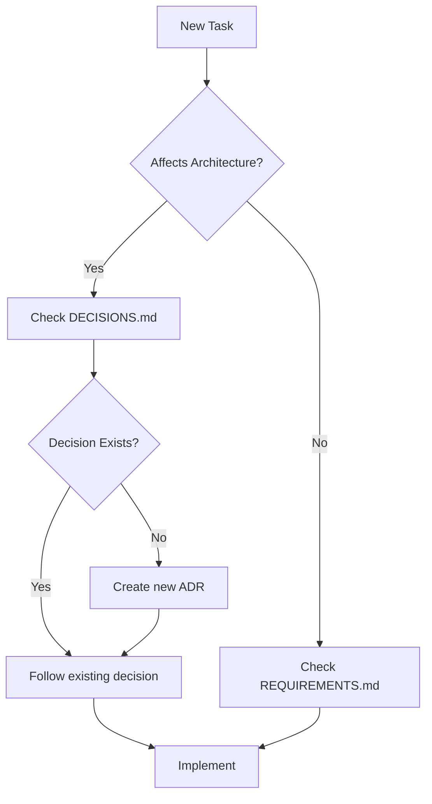

# Monster Self-Drive Documentation

Welcome to the Monster Self-Drive project documentation.

This directory contains all technical documentation, architectural
decisions, and project planning materials.

---

## 📚 Documentation Index

### 🚨 Critical Documents (Read First)

| Document | Purpose | Status | Priority |
|----------|---------|--------|----------|
| [CRITICAL_GAPS.md](./CRITICAL_GAPS.md) | Identifies unresolved issues and inconsistencies | ⚠️ Active | **P0** |
| [DECISIONS.md](./DECISIONS.md) | Architectural Decision Records (ADRs) | 🟡 In Progress | **P0** |

### 📋 Core Project Documents

| Document | Purpose | Status |
|----------|---------|--------|
| [REQUIREMENTS.md](./REQUIREMENTS.md) | System requirements specification | ✅ Complete |
| [PROJECT_CONSTITUTION.md](./PROJECT_CONSTITUTION.md) | Code standards and guidelines | ✅ Complete |
| [IMPLEMENTATION_PLAN.md](./IMPLEMENTATION_PLAN.md) | 6-phase implementation plan | ✅ Complete |
| `ARCHITECTURE.md` | System architecture diagrams | ❌ Not yet created |

### 🔧 Technical Specifications (Future)

Planned technical documentation:

- `GPIO_PINOUT.md` - Complete GPIO pin assignments
- `HARDWARE_SETUP.md` - Hardware assembly guide
- `CALIBRATION.md` - Sensor calibration procedures
- `DEPLOYMENT.md` - Installation and deployment guide
- `THREADING.md` - Threading model and synchronization
- `SAFETY.md` - Safety system architecture
- `API.md` - WebSocket API specification

---

## 🚦 Project Status

**Current Phase:** Pre-Phase 1 (Planning)
**Blockers:** See [CRITICAL_GAPS.md](./CRITICAL_GAPS.md)

### Critical Decisions Required

Before starting Phase 1 implementation, the following **P0 blockers** must be resolved:

1. ✅ WebSocket Library Selection (See ADR-001)
2. ✅ Multi-User Control Model (See ADR-004)
3. ⏳ GPIO Pin Assignments (See ADR-010)
4. ⏳ Safety System Integration (See ADR-009)

**Legend:**

- ✅ = Proposed decision documented, awaiting approval
- ⏳ = Not yet documented
- ❌ = Blocker, urgent attention needed

---

## 📖 How to Use This Documentation

### For Developers

1. **Starting Development:**
   - Read [CRITICAL_GAPS.md](./CRITICAL_GAPS.md) to understand current issues
   - Review relevant ADRs in [DECISIONS.md](./DECISIONS.md)
   - Check for blockers affecting your work

2. **Making Architectural Decisions:**
   - Review existing ADRs to avoid conflicts
   - Document new decisions in [DECISIONS.md](./DECISIONS.md)
   - Update [CRITICAL_GAPS.md](./CRITICAL_GAPS.md) when resolving gaps

3. **Before Each Phase:**
   - Ensure all P0 decisions for that phase are approved
   - Update IMPLEMENTATION.md with phase details
   - Review REQUIREMENTS.md for phase requirements

### For Project Managers

1. **Tracking Progress:**
   - Use [CRITICAL_GAPS.md](./CRITICAL_GAPS.md) Priority Matrix
   - Track ADR status in [DECISIONS.md](./DECISIONS.md)
   - Weekly review of 🟡 Proposed decisions

2. **Planning Phases:**
   - Check [CRITICAL_GAPS.md](./CRITICAL_GAPS.md) for blockers
   - Ensure P0 decisions resolved before phase start
   - Update timelines based on decision resolution

### For Contributors

1. **Understanding the Project:**
   - Start with main [README.md](../README.md)
   - Read [CRITICAL_GAPS.md](./CRITICAL_GAPS.md) for current challenges
   - Review relevant sections of [DECISIONS.md](./DECISIONS.md)

2. **Contributing:**
   - Check if your contribution affects any pending ADRs
   - Document new architectural decisions
   - Update existing documentation when resolving gaps

---

## 🔄 Documentation Workflow

### When Starting Work



### When Resolving a Gap

1. Research and analyze the gap
2. Create or update ADR in DECISIONS.md
3. Mark gap as resolved in CRITICAL_GAPS.md
4. Update affected documents (REQUIREMENTS, IMPLEMENTATION, etc.)
5. Create PR with all documentation updates

### When Making Decisions

1. Check for existing ADRs on similar topics
2. Document decision in DECISIONS.md following ADR format
3. Include context, alternatives, and consequences
4. Update priority and status
5. Link from relevant documents

---

## 📁 Directory Structure

```text
docs/
├── README.md                  # This file - documentation overview
├── CRITICAL_GAPS.md           # Unresolved issues and blockers
├── DECISIONS.md               # Architectural Decision Records
│
├── [Future] requirements/     # Detailed requirements
│   ├── REQUIREMENTS.md
│   └── use-cases/
│
├── [Future] architecture/     # System architecture
│   ├── ARCHITECTURE.md
│   ├── diagrams/
│   └── THREADING.md
│
├── [Future] api/              # API specifications
│   ├── API.md
│   └── websocket-protocol.md
│
├── [Future] hardware/         # Hardware documentation
│   ├── GPIO_PINOUT.md
│   ├── HARDWARE_SETUP.md
│   └── wiring-diagrams/
│
└── [Future] guides/           # User and developer guides
    ├── DEPLOYMENT.md
    ├── CALIBRATION.md
    └── TROUBLESHOOTING.md
```

---

## 🔗 Related Resources

### External Documentation

- [ThunderBorg Documentation](https://www.piborg.org/motors-1135/thunderborg)
- [OpenCV Tracking Algorithms](https://docs.opencv.org/4.x/d9/df8/group__tracking.html)
- [Flask-SocketIO Documentation](https://flask-socketio.readthedocs.io/)
- [Raspberry Pi GPIO Documentation](https://www.raspberrypi.com/documentation/computers/raspberry-pi.html)

### Internal Resources

- Main [README.md](../README.md) - Project overview
- [Settings.py](../Settings.py) - Current configuration
- [ImageProcessor.py](../ImageProcessor.py) - Image processing code
- [monsterWeb.py](../monsterWeb.py) - Web interface

---

## ✅ Documentation Standards

### Markdown Guidelines

- Use GitHub-flavored Markdown
- Include table of contents for documents > 100 lines
- Use semantic line breaks (one sentence per line for easier diffs)
- Include last updated date at top of each document
- Use emojis sparingly for visual scanning (🚨⚠️✅❌)

### ADR Format

Follow the format in DECISIONS.md:

1. Context (problem statement)
2. Decision (what we chose)
3. Status (Proposed/Accepted/Deprecated/Superseded)
4. Consequences (positive and negative)
5. Alternatives Considered (other options)

### Code Examples

Include code examples in documentation:

```python
# Good: Include context and explanation
def example_function():
    """Clear docstring explaining purpose."""
    pass  # Implementation
```

### Diagrams

- Use Mermaid for flowcharts and diagrams (renders in GitHub)
- Include source files for complex diagrams
- Store in `docs/architecture/diagrams/`

---

## 📝 Maintenance

### Review Schedule

- **Weekly:** Review all 🟡 Proposed ADRs
- **Before Each Phase:** Review all documentation for updates
- **Monthly:** Check for outdated content
- **After Major Decisions:** Update affected documents

### Document Owners

| Document | Owner | Reviewer |
|----------|-------|----------|
| CRITICAL_GAPS.md | Project Lead | Team |
| DECISIONS.md | Architecture Lead | Project Lead |
| REQUIREMENTS.md | Product Owner | Team |
| IMPLEMENTATION.md | Tech Lead | Architecture Lead |

### Version History

Track major documentation changes:

| Date | Changes | Author |
|------|---------|--------|
| 2025-12-06 | Initial documentation structure created | Claude |
| 2025-12-06 | Added CRITICAL_GAPS.md identifying 14+ issues | Claude |
| 2025-12-06 | Added DECISIONS.md with ADR framework | Claude |

---

## 🆘 Need Help?

### Questions About Documentation

1. Check if an ADR exists in [DECISIONS.md](./DECISIONS.md)
2. Review [CRITICAL_GAPS.md](./CRITICAL_GAPS.md) for known issues
3. Search existing issues in project tracker
4. Ask in team chat/forum

### Reporting Documentation Issues

- Missing information: Create issue with "docs" label
- Inconsistencies: Reference in [CRITICAL_GAPS.md](./CRITICAL_GAPS.md)
- Suggestions: Create PR with proposed changes

### Contributing to Documentation

1. Fork repository
2. Create branch: `docs/description-of-change`
3. Make changes following standards above
4. Submit PR with clear description
5. Reference related ADRs or gaps

---

## 🎯 Next Steps

### Immediate Actions (This Week)

- [ ] Review and approve ADR-001 (WebSocket Library)
- [ ] Review and approve ADR-004 (Multi-User Control)
- [ ] Create GPIO_PINOUT.md specification
- [ ] Document safety system architecture (ADR-009)

### Short Term (This Month)

- [ ] Migrate existing docs to this structure
- [ ] Create REQUIREMENTS.md from existing materials
- [ ] Create ARCHITECTURE.md with diagrams
- [ ] Resolve all P0 blockers in CRITICAL_GAPS.md

### Long Term

- [ ] Create comprehensive hardware setup guide
- [ ] Document all calibration procedures
- [ ] Build API documentation
- [ ] Create troubleshooting guide

---

**Last Updated:** 2025-12-06
**Maintainer:** Project Team
**License:** See [LICENSE](../LICENSE) file

For the latest updates and to contribute, visit the project repository.
