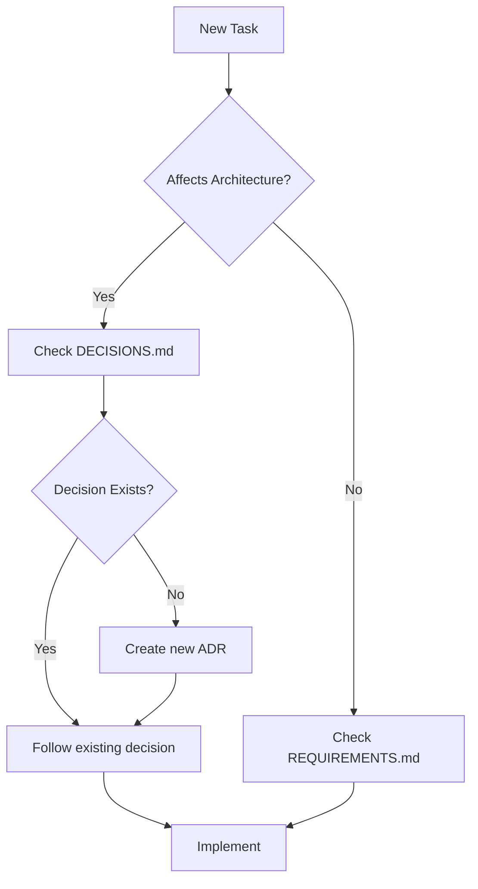

# Monster Self-Drive Documentation

Welcome to the Monster Self-Drive project documentation.

This directory contains all technical documentation, architectural
decisions, and project planning materials.

---

## 📚 Documentation Index

### 🚨 Start Here

| Document | Purpose | Status |
|----------|---------|--------|
| [DOCUMENTATION_MAP.md](./DOCUMENTATION_MAP.md) | **Visual guide to all documentation** | ✅ Current |
| [DECISIONS_SUMMARY.md](./DECISIONS_SUMMARY.md) | Quick summary of all ADRs | ✅ Complete |

### 📋 Core Project Documents

| Document | Purpose | Status |
|----------|---------|--------|
| [REQUIREMENTS.md](./REQUIREMENTS.md) | System requirements specification | ✅ Complete |
| [PROJECT_CONSTITUTION.md](./PROJECT_CONSTITUTION.md) | Code standards and guidelines | ✅ Complete |
| [IMPLEMENTATION_PLAN.md](./IMPLEMENTATION_PLAN.md) | 6-phase implementation plan | ✅ Complete |
| [SECURITY.md](./SECURITY.md) | Security guidelines and threat model | ✅ Complete |

### 🎯 Planning & Decisions

| Document | Purpose | Status |
|----------|---------|--------|
| [DECISIONS.md](./DECISIONS.md) | All 10 Architectural Decision Records | ✅ All Accepted |
| [CRITICAL_GAPS.md](./CRITICAL_GAPS.md) | Gap analysis and resolution status | ✅ All P0/P1 Resolved |

### 🔧 Technical Specifications (Future)

Planned technical documentation:

- `GPIO_PINOUT.md` - Complete GPIO pin assignments
- `HARDWARE_SETUP.md` - Hardware assembly guide
- `CALIBRATION.md` - Sensor calibration procedures
- `DEPLOYMENT.md` - Installation and deployment guide
- `THREADING.md` - Threading model and synchronization
- `SAFETY.md` - Safety system architecture
- `API.md` - WebSocket API specification

---

## 🚦 Project Status

**Current Phase:** Pre-Phase 1 (Ready for Implementation)
**Architecture:** ✅ Complete - All 10 ADRs Accepted
**Status:** Ready to begin Phase 1 implementation

### ✅ All Architectural Decisions Complete

All P0 blockers and P1 high-priority decisions have been resolved:

1. ✅ WebSocket Library Selection (ADR-001)
2. ✅ Configuration Format (ADR-002)
3. ✅ Directory Structure (ADR-003)
4. ✅ Multi-User Control Model (ADR-004)
5. ✅ Tracking Algorithm (ADR-005)
6. ✅ IMU Hardware Status (ADR-006)
7. ✅ Frame Rate Requirements (ADR-007)
8. ✅ Threading Model (ADR-008)
9. ✅ Safety System Architecture (ADR-009)
10. ✅ GPIO Pin Assignments (ADR-010)

**See [DECISIONS_SUMMARY.md](./DECISIONS_SUMMARY.md) for details.**

---

## 📖 How to Use This Documentation

### Quick Start

**New to the project?** Start with [DOCUMENTATION_MAP.md](./DOCUMENTATION_MAP.md) for
a visual guide to all documentation and reading paths.

### For Developers

1. **Starting Development:**
   - Review [DOCUMENTATION_MAP.md](./DOCUMENTATION_MAP.md) for document relationships
   - Read [DECISIONS_SUMMARY.md](./DECISIONS_SUMMARY.md) for architectural overview
   - Review relevant ADRs in [DECISIONS.md](./DECISIONS.md) for specific areas

2. **Making Architectural Decisions:**
   - Review existing ADRs to avoid conflicts
   - Document new decisions in [DECISIONS.md](./DECISIONS.md) following ADR format
   - Update affected documents with cross-references

3. **Before Each Phase:**
   - Review [IMPLEMENTATION_PLAN.md](./IMPLEMENTATION_PLAN.md) for phase details
   - Check [REQUIREMENTS.md](./REQUIREMENTS.md) for specifications
   - Review [SECURITY.md](./SECURITY.md) for security considerations

### For Project Managers

1. **Tracking Progress:**
   - Use [DECISIONS_SUMMARY.md](./DECISIONS_SUMMARY.md) for quick status
   - Review [IMPLEMENTATION_PLAN.md](./IMPLEMENTATION_PLAN.md) for phase progress
   - Check [CRITICAL_GAPS.md](./CRITICAL_GAPS.md) for any remaining issues

2. **Planning Phases:**
   - All P0 and P1 architectural decisions are complete
   - Ready to begin Phase 1 implementation
   - See [DECISIONS_SUMMARY.md](./DECISIONS_SUMMARY.md) next steps

### For Contributors

1. **Understanding the Project:**
   - Start with main [README.md](../README.md)
   - Review [DOCUMENTATION_MAP.md](./DOCUMENTATION_MAP.md) for structure
   - Read [PROJECT_CONSTITUTION.md](./PROJECT_CONSTITUTION.md) for standards

2. **Contributing:**
   - Follow code standards in [PROJECT_CONSTITUTION.md](./PROJECT_CONSTITUTION.md)
   - Review [SECURITY.md](./SECURITY.md) for security requirements
   - Update documentation when making architectural changes

---

## 🔄 Documentation Workflow

### When Starting Work



### When Resolving a Gap

1. Research and analyze the gap
2. Create or update ADR in DECISIONS.md
3. Mark gap as resolved in CRITICAL_GAPS.md
4. Update affected documents (REQUIREMENTS, IMPLEMENTATION, etc.)
5. Create PR with all documentation updates

### When Making Decisions

1. Check for existing ADRs on similar topics
2. Document decision in DECISIONS.md following ADR format
3. Include context, alternatives, and consequences
4. Update priority and status
5. Link from relevant documents

---

## 📁 Directory Structure

```text
docs/
├── README.md                  # This file - documentation overview
├── CRITICAL_GAPS.md           # Unresolved issues and blockers
├── DECISIONS.md               # Architectural Decision Records
│
├── [Future] requirements/     # Detailed requirements
│   ├── REQUIREMENTS.md
│   └── use-cases/
│
├── [Future] architecture/     # System architecture
│   ├── ARCHITECTURE.md
│   ├── diagrams/
│   └── THREADING.md
│
├── [Future] api/              # API specifications
│   ├── API.md
│   └── websocket-protocol.md
│
├── [Future] hardware/         # Hardware documentation
│   ├── GPIO_PINOUT.md
│   ├── HARDWARE_SETUP.md
│   └── wiring-diagrams/
│
└── [Future] guides/           # User and developer guides
    ├── DEPLOYMENT.md
    ├── CALIBRATION.md
    └── TROUBLESHOOTING.md
```

---

## 🔗 Related Resources

### External Documentation

- [ThunderBorg Documentation](https://www.piborg.org/motors-1135/thunderborg)
- [OpenCV Tracking Algorithms](https://docs.opencv.org/4.x/d9/df8/group__tracking.html)
- [Flask-SocketIO Documentation](https://flask-socketio.readthedocs.io/)
- [Raspberry Pi GPIO Documentation](https://www.raspberrypi.com/documentation/computers/raspberry-pi.html)

### Internal Resources

- Main [README.md](../README.md) - Project overview
- [Settings.py](../Settings.py) - Current configuration
- [ImageProcessor.py](../ImageProcessor.py) - Image processing code
- [monsterWeb.py](../monsterWeb.py) - Web interface

---

## ✅ Documentation Standards

### Markdown Guidelines

- Use GitHub-flavored Markdown
- Include table of contents for documents > 100 lines
- Use semantic line breaks (one sentence per line for easier diffs)
- Include last updated date at top of each document
- Use emojis sparingly for visual scanning (🚨⚠️✅❌)

### ADR Format

Follow the format in DECISIONS.md:

1. Context (problem statement)
2. Decision (what we chose)
3. Status (Proposed/Accepted/Deprecated/Superseded)
4. Consequences (positive and negative)
5. Alternatives Considered (other options)

### Code Examples

Include code examples in documentation:

```python
# Good: Include context and explanation
def example_function():
    """Clear docstring explaining purpose."""
    pass  # Implementation
```

### Diagrams

- Use Mermaid for flowcharts and diagrams (renders in GitHub)
- Include source files for complex diagrams
- Store in `docs/architecture/diagrams/`

---

## 📝 Maintenance

### Review Schedule

- **Weekly:** Review all 🟡 Proposed ADRs
- **Before Each Phase:** Review all documentation for updates
- **Monthly:** Check for outdated content
- **After Major Decisions:** Update affected documents

### Document Owners

| Document | Owner | Reviewer |
|----------|-------|----------|
| CRITICAL_GAPS.md | Project Lead | Team |
| DECISIONS.md | Architecture Lead | Project Lead |
| REQUIREMENTS.md | Product Owner | Team |
| IMPLEMENTATION.md | Tech Lead | Architecture Lead |

### Version History

Track major documentation changes:

| Date | Changes | Author |
|------|---------|--------|
| 2025-12-06 | Initial documentation structure created | Claude |
| 2025-12-06 | Added CRITICAL_GAPS.md identifying 14+ issues | Claude |
| 2025-12-06 | Added DECISIONS.md with ADR framework | Claude |
| 2025-12-06 | ADRs 001-006 accepted | Claude |
| 2025-12-07 | ADRs 007-010 accepted - All ADRs complete | Claude |
| 2025-12-07 | Documentation cleanup - removed historical docs | Claude |
| 2025-12-07 | Added DOCUMENTATION_MAP.md with mermaid diagram | Claude |

---

## 🆘 Need Help?

### Questions About Documentation

1. Check if an ADR exists in [DECISIONS.md](./DECISIONS.md)
2. Review [CRITICAL_GAPS.md](./CRITICAL_GAPS.md) for known issues
3. Search existing issues in project tracker
4. Ask in team chat/forum

### Reporting Documentation Issues

- Missing information: Create issue with "docs" label
- Inconsistencies: Reference in [CRITICAL_GAPS.md](./CRITICAL_GAPS.md)
- Suggestions: Create PR with proposed changes

### Contributing to Documentation

1. Fork repository
2. Create branch: `docs/description-of-change`
3. Make changes following standards above
4. Submit PR with clear description
5. Reference related ADRs or gaps

---

## 🎯 Next Steps

### ✅ Architectural Planning Complete

All architectural decisions (ADRs 001-010) have been accepted and documented.

### Immediate Actions - Pre-Phase 1 Migrations

- [ ] Migrate to src/ directory structure (ADR-003)
- [ ] Convert Settings.py to JSON loader (ADR-002)
- [ ] Create config.json with current settings
- [ ] Create JSON Schema for validation

### Phase 1 Implementation

- [ ] Implement Flask-SocketIO server (ADR-001)
- [ ] Create Motor Control and Safety Monitor threads (ADR-008)
- [ ] Implement single-user ControlManager (ADR-004)
- [ ] Add web UI control status indicators
- [ ] Implement FPS-based speed limiting (ADR-007)

### Future Documentation

- [ ] Create comprehensive hardware setup guide
- [ ] Document all calibration procedures
- [ ] Build WebSocket API documentation
- [ ] Create troubleshooting guide

---

**Last Updated:** 2025-12-07
**Maintainer:** Project Team
**License:** See [LICENSE](../LICENSE) file

For the latest updates and to contribute, visit the project repository.
